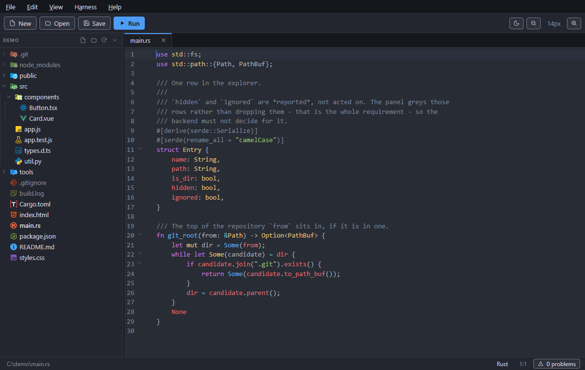

# JustCode

**A small, fast code editor for Windows, macOS and Linux.** It opens instantly,
stays out of the way, and does the things you actually asked a text editor to
do.

<br clear="left">



## What this is

JustCode is a deliberate reaction to editors that have become platforms. It is
one native window over a CodeMirror 6 buffer, with a Rust shell doing the file
dialogs, disk access, terminals and process launching. That is the whole
architecture.

- **Light.** One window, one process tree, no background language servers, no
  indexer crawling your project, no update daemon. What it needs to show you a
  file is what it uses.
- **Fast to start.** The theme is painted on the first frame, before the bundle
  loads, so there is no white flash and no splash screen — the window that
  appears is the editor. Boot time is measured on every launch rather than
  assumed.
- **No plugin architecture.** Nothing to install, nothing to configure, nothing
  that can slow the editor down or break it after an update. Everything below is
  in the box, and the whole feature set is one page long on purpose.
- **No useless features.** No telemetry, no account, no AI sidebar, no
  marketplace, no onboarding tour, nothing that phones home. The one thing that
  talks to the network is **Help → New Version**, and only when you click it.
- **It is a text editor.** Syntax highlighting, linting, find and replace, split
  panes, a real terminal, a file tree. Not an IDE, and not trying to become one.

The tradeoff is honest and worth stating: there is no debugger, no refactoring
engine and no language-server intelligence. If you want those, use an IDE —
they are good at it. JustCode is for the other half of the day.

## Features

Everything is reachable three ways: the **File** and **View** menus, the toolbar
buttons, and keyboard shortcuts.

| Feature | How |
| --- | --- |
| New file | `Ctrl+N` / **New** / double-click the empty strip right of the tabs |
| Open file | `Ctrl+O` / **Open** — multi-select supported |
| Open folder | `Ctrl+K Ctrl+O` / **File → Open Folder** — the folder's tree appears in the Explorer |
| Show/hide the Explorer | `Ctrl+Shift+E` / **View → Explorer** |
| New file / folder in the tree | right-click in the Explorer, or its header buttons |
| Rename / delete in the tree | `F2` / `Del` — Delete goes to the Recycle Bin |
| Move / copy in the tree | drag a row, or `Ctrl`-drag to copy |
| Save | `Ctrl+S` / **Save** |
| Save as | `Ctrl+Shift+S` |
| Close tab | `Ctrl+W`, the tab's `×`, or middle-click |
| Split view | drag a tab to a pane's left/right/top/bottom edge |
| Un-split | drag the tab back onto another pane's tab bar |
| Close all but current | **File → Close All But Current** |
| Close all | `Ctrl+Shift+W` / **File → Close All** |
| Minimize | `Alt+M` / **File → Minimize** |
| Exit | `Alt+F4` / **File → Exit** |
| Cut / Copy / Paste | `Ctrl+X` / `Ctrl+C` / `Ctrl+V` / **Edit** menu |
| Select all | `Ctrl+A` / **Edit → Select All** |
| Delete line | `Ctrl+Shift+K` / **Edit → Delete Line** |
| Move line up / down | `Alt+↑` / `Alt+↓` / **Edit → Move Line Up/Down** |
| Toggle comment | `Ctrl+/` / **Edit → Toggle Comment** |
| Uppercase / Lowercase | `Ctrl+Shift+U` / `Ctrl+Shift+L` (selection, or the word at the caret) |
| Generate GUID | `Ctrl+Alt+G` (inserts a v4 UUID) |
| Open link under caret | `Ctrl+Enter`, or `Ctrl`/`Cmd`-click a URL |
| Toggle bookmark 1–3 | `Ctrl+Shift+1` … `Ctrl+Shift+3` / **Edit** menu |
| Go to bookmark 1–3 | `Ctrl+1` … `Ctrl+3` / **Edit** menu |
| Switch tab | `Ctrl+Tab` / `Ctrl+Shift+Tab`, or `Ctrl+PageUp` / `Ctrl+PageDown` (wraps) |
| Copy file path | click the path in the status bar, or **File → Copy File Path** |
| Reveal the file | **File → Show in Explorer / Finder / File Manager** |
| Move tab | `Ctrl+Shift+PageUp` / `Ctrl+Shift+PageDown` / **View → Move Tab Left/Right** |
| Move tab to the front | `Alt+Home` / **View → Move Tab to Beginning** |

Standard editor navigation works throughout: double-click selects a word,
`Ctrl+Shift+←/→` extends by word, `Shift+Home/End` selects to the line
start/end, and `PageUp`/`PageDown` (with `Shift` to extend) move by a page.
| Run in default browser | `F5` / **Run** |
| Zoom in | `Ctrl++`, `Ctrl+=`, `Ctrl+Wheel up`, **A+** |
| Zoom out | `Ctrl+-`, `Ctrl+Wheel down`, **A−** |
| Reset zoom | `Ctrl+0` |
| Light / dark theme | **View → Light/Dark Theme**, or the sun/moon toolbar button |
| Show/hide toolbar | **View → Toolbar** |
| Show/hide status bar | **View → Status Bar** |
| Spell check (off by default) | **View → Spell Check** |
| Interface language (36) | **View → Language…** |
| Keyboard shortcuts | `F1` / **Help → Shortcuts** |
| Version | **Help → About JustCode** |
| Check for a newer version | **Help → New Version** |
| Find / replace | `Ctrl+F` / `Ctrl+H` |
| Go to symbol | `Ctrl+Shift+G` / **Edit → Go to Symbol…** — a filterable list of the declarations in the current file. Disabled for a language with no symbol support, such as plain text |
| Problems panel | `F8` opens and closes it / **View → Problems**, or click the problem count in the status bar |
| Next / previous problem | `F4` / `Shift+F4` / **View → Next/Previous Problem** (wraps) |

The menu bar is always visible, so the toolbar and status bar can be brought
back after hiding them. Theme, zoom level and bar visibility all persist between
sessions. Menu items list their keyboard shortcut and repeat it as a hover
tooltip.

### Reopening the last session

The files that were open when you left are reopened at the next launch, back in
the panes they were spread across and at the line each caret was on. Only saved
files come back — an untitled buffer has nothing on disk to reopen, and the
unsaved-changes prompt on the way out has already settled what happens to it.
Files deleted in the meantime are skipped without a word.

A document opened from Explorer joins that restored workspace and takes the
focus, rather than replacing it.

### Status bar

The status bar shows the cursor position as `line:column` and the current
language. Clicking the language opens a VS Code-style "Select Language Mode"
picker — a filterable, arrow-navigable list — that changes the syntax
highlighting for the active tab without renaming the file. A hand-picked mode
sticks; only files left on their auto-detected mode follow a later Save As.

### Toggle comment

`Ctrl+/` (or **Edit → Toggle Comment**) comments or uncomments using the
language's own syntax, chosen by what is selected:

- A single line uses the line-comment token when the language has one — `//`
  (JS, Rust, Dart, Object Pascal), `--` (SQL), `#` (YAML, Shell).
- A selection spanning several lines uses the block-comment token when the
  language has one — `/* */` (JS, CSS), `<!-- -->` (HTML), `{ }` (Object
  Pascal), `<# #>` (PowerShell).
- Languages with only one comment style use whichever they have; with no
  selection, a block-only language comments the whole current line rather than
  splitting it at the caret.

Clipboard actions (Cut/Copy/Paste) in the **Edit** menu go through the OS
clipboard via Tauri, so they work regardless of browser clipboard policy; the
same operations also work with the native `Ctrl+X/C/V` keys in the editor.

### Interface language

**View → Language…** switches the interface between 36 languages, listed by
their own names. English is the default and is built in; every other language is
one lazily-loaded module, so translations cost nothing at startup. The choice
persists between sessions, and the four right-to-left languages (Arabic, Hebrew,
Persian, Urdu) flip the whole layout via `dir="rtl"`.

Any string a translation is missing falls back to English, so a partial
translation degrades to mixed language rather than to raw key names. The
translations are machine-generated interface vocabulary — good enough to
navigate by, but worth a native speaker's review before shipping to users of
that language. The Shortcuts reference is not translated yet.

No flags are shown in the picker: Windows has no flag emoji glyphs (they render
as bare letter pairs), and a language is not the same thing as a country.

### Spell check

Off by default — in source code most identifiers would be flagged as
misspellings. **View → Spell Check** turns it on for every open tab, and the
choice persists between sessions.

Misspellings are reported as ordinary diagnostics, so they are underlined, are
counted in the status bar (`3 problems · 5 spelling`), and offer corrections in
the lint tooltip. Spelling is counted separately from syntax problems: it is
advisory, and folding it into the error count would make a prose-heavy file look
broken.

This replaced the webview's built-in checker, which could not report what it
found (so nothing could be counted or listed) and missed words, because it reads
the rendered DOM where syntax highlighting splits words across elements. The
dictionary is an English hunspell word list shipped as a static asset and
fetched only when spell check is first switched on, so it costs nothing at
startup. `camelCase` and `snake_case` identifiers are checked as their parts,
and common programming vocabulary is ignored.

### Split view

Drag a tab onto the **left, right, top or bottom quarter** of an editor to split
the window and move that file into the new pane, so several files are visible at
once. Dropping in the middle of a pane — or onto its tab bar — moves the tab
into that pane instead; dragging the last tab out of a pane closes the split, as
does closing its last tab. A translucent overlay previews where the tab will
land while dragging.

Each pane has its own tab bar and its own editor, and the focused pane is the
one the menus, shortcuts and status bar act on — click into a pane to target it.
Panes share one row or one column; the direction is set by the first split and
is free to change again once the layout is back to a single pane.

### Bookmarks

Three bookmark slots per file. `Ctrl+Shift+1`–`3` sets or clears one on the
caret's line, showing a numbered marker in its own gutter column; `Ctrl+1`–`3`
jumps back to it. Bookmarks belong to the document, so each tab keeps its own
set and they persist across tab switches, following their line as text is
inserted or deleted above. They are not saved to disk with the file.

### Links

URLs (`http`, `https`, `mailto`) in the text are detected and underlined.
`Ctrl`/`Cmd`-click one — or put the caret on it and press `Ctrl+Enter` — to open
it in the default browser. A pointer cursor appears over links while `Ctrl` is
held. Opening is restricted to web schemes in the Rust backend, so a document
can never launch an arbitrary handler.

### Languages

Syntax highlighting, code completion, auto-closing tags/brackets, bracket
matching, and code folding for:

**HTML · CSS · JavaScript · TypeScript · JSX/TSX · Markdown · Rust · Python ·
C / C++ · Java · C# · Kotlin · Swift · R · Go-style TOML · Protocol Buffers ·
JSON · YAML · XML · SQL · Dart · Object Pascal / Delphi · PowerShell · Batch ·
Shell/Bash**, plus **Plain Text** for `.txt`, `.log` and `.csv`.

TypeScript and JSX/TSX reuse the JavaScript grammar with the appropriate flags.
`.dproj` (Delphi project) is treated as XML. Batch (`.bat`, `.cmd`) is a
purpose-written mode — CodeMirror ships none — covering `REM`/`::` comments,
labels, `%VAR%` and delayed-expansion `!VAR!`, redirections and common commands.

SQL comes in four dialects, chosen by extension: `.sql` (standard), `.sqlite` /
`.sqlite3` (SQLite), `.mysql` (MySQL), and `.pgsql` / `.psql` (PostgreSQL) —
each with its own keyword set and quoting rules (e.g. MySQL backtick
identifiers).

Linting (error underlines + a problem count) is provided where it is meaningful:
HTML and XML (tag balance; HTML also parses embedded scripts), CSS, JavaScript,
JSON (parse errors), Rust and YAML (grammar errors). The other modes are
highlighted but not linted, so a TypeScript type annotation or Python construct
is never wrongly flagged.

Any file can be re-assigned a language on the fly from the status bar (see
below), and the mode picker lists every language above.

Object Pascal is a purpose-written mode covering Delphi specifics the generic
Pascal mode misses: `{$...}` compiler directives, `unit`/`interface`/`property`,
`''` string escapes, `#13` character literals, and `$FF` hex numbers. Contextual
directives such as `name`, `index` and `read` are treated as identifiers, since
a stream tokenizer cannot tell a directive from a variable of the same name.

### Find and replace

A VS Code-style panel pinned to the top of the editor:

- `Ctrl+F` opens find, `Ctrl+H` opens find with the replace row expanded.
- A live **"N of M" match counter**, `Aa` (case), `.*` (regex) and `ab` (whole
  word) toggles, and inline validation for a malformed regex.
- `Enter` / `Shift+Enter` and `F3` / `Shift+F3` step through matches; `Escape`
  closes and returns focus to the editor.

### Markdown preview

Running (`F5`) a `.md` file converts it to a styled, standalone HTML document in
a temp folder and opens that in your browser. The generated page follows your OS
light/dark setting. Raw HTML embedded in the Markdown is passed through, as
GitHub does — only run Markdown you trust.

### Opening files from Explorer

The installer associates JustCode with the source extensions it supports.
Double-clicking such a file opens it in JustCode; if a window is already open the
file joins it as a new tab rather than starting a second copy. Files can also be
passed on the command line.

### Theming

Both themes cover the app chrome and the editor. The chrome is driven by CSS
variables under `:root[data-theme=...]`; the editor swaps between one-dark and a
matching light theme held in a CodeMirror compartment. Because tabs that are not
on screen are plain `EditorState` objects with no view to dispatch through,
their stored states are advanced directly — otherwise a background tab would
keep the old theme until it was edited.

### Linting

- **HTML** — tag balance (unclosed elements, stray closing tags, void elements
  handled), plus Acorn parsing of every embedded `<script>` block. Non-JS script
  types such as `application/ld+json` are left alone.
- **CSS** — malformed rules and blocks via the parser's error nodes, plus an
  explicit check for declarations with no value (`color: ;`), which the parser
  otherwise accepts silently.
- **JavaScript** — real parse errors from [Acorn](https://github.com/acornjs/acorn)
  with the original message, e.g. *"Unexpected token"*, *"Unterminated string constant"*.

Errors are underlined, marked in the lint gutter, and counted in the status bar.
Each problem is reported once: when tags are unbalanced the parser's downstream
error nodes are suppressed, since they are symptoms of the same mistake.

### Run

For a **PowerShell, Batch or shell script**, `F5` saves the file and runs it in
its own console window, from the folder it lives in, so its output stays visible
after it finishes. The Rust side only accepts those interpreters, so this cannot
be used to launch arbitrary programs.

For an `.html` file, `F5` saves every open file that has a path, saves the target
`.html` (asking for a location if it has none), then hands that file to the OS
shell, which opens it in your default browser. Relative `<link href="style.css">`
and `<script src="app.js">` references resolve because the page loads from its own
directory. For a `.md` file it renders a preview instead (see above). The target
is the active tab when it is HTML or Markdown; otherwise the most recently opened
`.html` tab.

## Terminal

``Ctrl+` `` toggles a panel of shells at the bottom of the window; **View ▸ New
Terminal** picks the profile. Each one is a real pseudo-terminal (PowerShell or
Command Prompt on Windows) whose output is streamed to xterm.js, so interactive
programs, colours and resizing all behave. New terminals start in the folder of
the file being edited. xterm.js is loaded on demand, so it costs nothing at boot.

Terminals are set in the editor's font size and follow it: `Ctrl+±` zooms both
halves of the window together, so the shell never ends up smaller than the code
above it.

The panel docks to the bottom, the left or the right: drag its header to that
edge of the workspace, or pick one from **View ▸ Terminal Position**. Docked to a
side it becomes a column beside the code, with its own drag handle on the edge
that faces the editor. The choice persists between sessions.

Administrator shells open in their own window rather than in the panel. That is
not a shortcut: a process that is not elevated cannot read an elevated child's
pipes, so an elevated shell cannot be embedded at all.

## File associations

**File ▸ File Associations…** lists every type the editor knows, grouped by
language, with Select All / Unselect All. Applying writes per-user entries under
`HKCU\Software\Classes`, so it needs no administrator rights.

Two things worth knowing. Types another program already handles are marked with
that program's name and left unticked, so clicking through the screen cannot
quietly take `.pas` away from Delphi. And where Windows has recorded your own
choice for a type (its hash-protected `UserChoice` key, which applications are
not permitted to forge), that choice stands — JustCode is added to the "Open
with" list instead of becoming the default.

The **installer** registers the same file types up front, and its list is
generated from the language registry rather than maintained by hand:

```powershell
npm run sync:associations    # regenerate bundle.fileAssociations
npm run check:associations   # fail if it has drifted from the registry
```

Both the installer and the in-app screen write the same per-extension ProgID
(`JustCode.<ext>`), so toggling a type in the app cleanly overrides what the
installer registered instead of leaving a second, competing entry behind.

## The Explorer

**File → Open Folder** (`Ctrl+K Ctrl+O`) opens one folder as a tree beside the
editor. `Ctrl+Shift+E` shows and hides it, like the toolbar and the status bar,
and the folder you had open — along with which branches were expanded — comes
back at the next launch.

- **Material Icon Theme icons.** The full upstream set, vendored at build time
  from the `material-icon-theme` package (MIT) into `public/file-icons/`, so
  the tree looks like the one people already know and needs no network.
- **Hidden and ignored files are shown, greyed.** A dotfile, a Windows
  hidden/system file, and anything `git check-ignore` would match are all dimmed
  rather than dropped — nothing in the folder is invisible, and the tooltip says
  which of the two it is. Nested `.gitignore` files, negations and
  `core.excludesFile` are all honoured, via ripgrep's `ignore` crate.
- **The usual file operations**, from the right-click menu: new file and folder,
  cut, copy, paste, duplicate, rename (`F2`), delete (`Del`), copy path, copy
  relative path, reveal in the file manager, and open a terminal there. Deleting
  goes to the Recycle Bin, never to nothing — and if the trash is unavailable
  the operation fails and says so rather than falling back to a real delete.
- **Drag to move, `Ctrl`-drag to copy.** A folder cannot be dropped into its own
  subtree; that guard runs in the UI and again in the backend, because a symlink
  can lie to the UI.
- **Keyboard throughout.** Arrows walk the tree, `←`/`→` collapse and expand,
  `Enter` opens, `Home`/`End` jump, `Space` toggles selection, and typing jumps
  to a name. Rows are a proper ARIA tree, so a screen reader gets the levels and
  positions.

The tree is read one folder at a time, so a root containing `node_modules` costs
one row until you open it. Folders that are open are polled once a second, so a
file created from a terminal shows up on its own.

## A note on updates

**Help → New Version** asks GitHub for the newest release and, if there is one,
downloads that platform's installer and hands it to the system. It runs only
when the menu item is chosen; nothing is checked at startup.

The installers are published to `nebosa-company/justcode-releases` rather than
to this repository. This one is private, and GitHub answers an unauthenticated
request about a private repository with 404, so a release published here would
be invisible to the check. The releases repository carries no source — only the
built installers — which is what lets the check run without a token in the app.

The download is **not signature-verified**. `RELEASE_PREFIX` in
`src-tauri/src/lib.rs` refuses any URL that is not on that repository's release
path, and the transfer is HTTPS, so the trust boundary is GitHub's TLS and
whoever can push a release to that repository. Nothing beyond that is checked
before the installer is handed to the OS to run. Signing the releases, or
publishing checksums and verifying them after the download, are both real
improvements and neither is done today.

## A note on the Content Security Policy

`tauri.conf.json` sets `"csp": null` deliberately. A CSP was tried and reverted:
Tauri injects a nonce into `style-src` for its own assets, and by the CSP spec a
nonce causes `'unsafe-inline'` to be **ignored** — which blocks the ~18 KB
`<style>` element CodeMirror writes at runtime. The result is an editor with no
styling at all: no gutter, no highlighting, text sitting wherever it lands.

Adding a CSP back therefore means giving CodeMirror's runtime stylesheet a nonce
or a hash first (or pre-extracting it into a static file). It is worth doing —
the commands exposed over IPC read and write arbitrary files — but it is a real
piece of work, not a one-line config change.

## Development

```powershell
npm install
npm run tauri dev      # hot-reloading dev build
npm run tauri build    # NSIS + MSI installers in src-tauri/target/release/bundle
npm run build:packed   # build, then UPX-compress the standalone exe (see tools/)
```

Requirements: Node 18+, the Rust toolchain, and the Microsoft C++ Build Tools
(WebView2 ships with Windows 11).

## Layout

```
index.html            app shell markup
src/main.js           tabs, file I/O, shortcuts, zoom, theme, menus, Run
src/editor.js         CodeMirror setup: base extensions, folding, theme wiring
src/languages.js      language registry: extensions → highlighting + linting
src/object-pascal.js  hand-written Object Pascal / Delphi stream mode
src/search.js         VS Code-style find/replace panel with match counter
src/markdown.js       Markdown → standalone HTML for the preview
src/theme.js          light editor theme + highlight style, paired with one-dark
src/menu.js           data-driven File/Edit/View menu bar + editor context menu
src/terminal.js       integrated terminal panel (xterm.js over a real pty)
src/icons.js          inline SVG icon set (currentColor, no network requests)
src/explorer.js       the Open Folder tree: rendering, keyboard, drag, context menu
src/filetree.js       its rules with no DOM: sorting, containment, names, icon lookup
tools/vendor-file-icons.mjs  vendors the Material Icon Theme into public/file-icons
src/linters.js        HTML tag balance, embedded-script and CSS/JS syntax linting
src/styles.css        themed chrome around the editor
src-tauri/src/lib.rs  file I/O, browser launch, Markdown preview, file-open args
scripts/pack.mjs      post-build UPX compression
sample/               a tiny three-file project to try Run on
```
