# The Perpetum manual

What the harness is, what it does in each phase, and what has to be true before
it moves on.

Everything here is read from the code rather than from intent: the commands come
from the dispatch table in `crates/perp/src/main.rs`, the phases and their exit
conditions from `crates/perp-core/src/phase.rs`, and the development loop from
`cycle.rs`, `agent.rs` and `engine.rs`. Where the code and the requirements
document disagree, this file follows the code and says so.

---

## 1. The shape of it

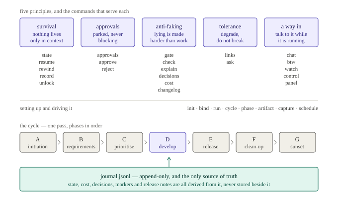

Five principles, from §1 of [`.harness/perpetum.md`](../../../.harness/perpetum.md).
Each exists because of a specific way an unattended loop goes wrong:

| Principle | The failure it answers |
|---|---|
| Survival | A loop running for days crosses many context windows, several restarts and at least one crash. Nothing may live only in context. |
| Non-blocking approvals | The loop stops for a person at certain steps. The other 95% has to keep running while that step is parked. |
| Anti-faking | A loop optimising for "green" will delete tests. Lying has to be mechanically harder than doing the work. |
| Local-model tolerance | A 7B model cannot be trusted to emit clean tool calls. The loop must degrade, not break. |
| A way in | A loop you cannot talk to is a batch job. `/btw` turns a passing thought into a tracked requirement without stopping the machine. |

Grouping the commands under the principle they serve is this document's
editorial choice, not the requirements document's. It covers 21 of the 29
commands; the other eight are setup and loop-driving, which serve no single
principle.

**The journal is the spine.** `journal.jsonl` is append-only and is the only
source of truth. State, cost, decisions, markers and release notes are all
*derived* from it and never stored beside it, so there is no second file that
can disagree. If this document and the journal disagree, the journal is right.

---

## 2. The cycle

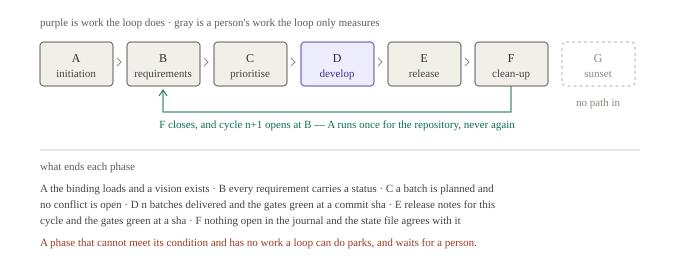

Seven phases, A to G, in order. The engine walks all of them — but this is the
part most worth understanding before anything else:

> **Only phase D contains work a machine can do.** B, C, E and F are a person's
> — gathering requirements, prioritising, writing release notes, reconciling —
> and pretending otherwise would have the loop asserting it had done them.

That is a quotation from `cycle.rs`, not a paraphrase. In every phase except D
the driver runs the gates, measures the workspace, and asks whether the phase's
exit condition is met. If it is not, and there is no work the loop can do, the
run **parks** and waits for a person.

So a cycle left running unattended does not march from A to G. It does D, and it
stops politely at the first phase whose condition a person has not yet satisfied.

**A runs once for the repository, not once per cycle.** When F closes, the next
cycle opens at B.

---

## 3. The step — the unit of durability

A cycle contains phases, a phase contains batches, and a batch contains
**steps**. The step is where durability actually lives, so it is worth
understanding before the phase walk below.

> A step is one bounded piece of work with a declared intent, a side effect, and
> a recorded outcome.

The model's turn is deliberately *not* the unit. A turn is a conversation; a
step is something that either happened or did not.

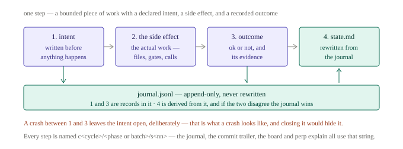

The order is the point. The intent is written **before** the side effect, not
after, so that a process which dies mid-work leaves evidence that it was trying
something. The outcome is written after. Both go in the append-only journal;
`state.md` is rewritten from the journal and never edited by hand.

Dropping a step without closing it leaves the intent open **on purpose**. That
is what a crash looks like, and tidying it away would hide the one thing
recovery needs to see.

### Recovery

Because an open intent is preserved rather than swept up, a restart can ask a
precise question: did that step's effect actually land?

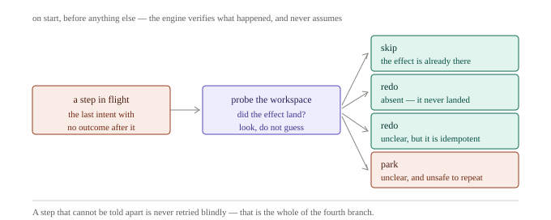

The engine probes the workspace for the answer rather than assuming one. Three
of the four branches resolve automatically; the fourth is the interesting one.
When the engine cannot tell whether the step landed **and** the step did not
declare itself idempotent, it parks and asks. A step that cannot be told apart
is never retried blindly — repeating a non-idempotent side effect is how a loop
turns a crash into corruption.

This is also why `L-8` insists context is disposable: a step may not depend on
anything that cannot be reconstructed from the binding, the state, the journal
and the workspace. Anything living only in a context window does not survive the
restart that this machinery exists to handle.

---

## 4. Phase A — initiation

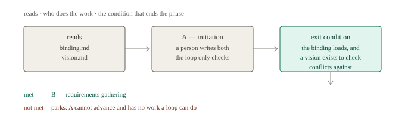

The one-time setup. A person writes the binding and the vision; the loop only
checks that both exist and that the binding parses.

The vision is not decoration — it is what conflicts are checked *against* later,
so a cycle with no vision has no way to tell a contradiction from a preference.

Once A has run for a repository it never runs again, even as later cycles open.

---

## 5. Phase B — requirements gathering

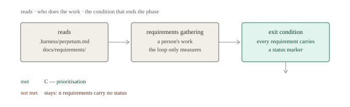

A person turns sources into requirements in `.harness/perpetum.md`. That file is
the only place ids are minted; everything else cites them.

The exit condition is blunt: **no requirement may carry no status at all.** An
unmarked row is one nobody has decided about, and letting the cycle move past it
would quietly drop it. Marked as won't-do is an answer; unmarked is not.

`perp check ids` verifies that no document invents an id that the source does
not define.

---

## 6. Phase C — prioritisation

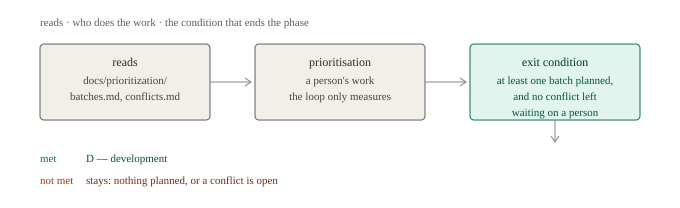

A person plans batches and resolves conflicts. Two things must hold before D
starts: at least one batch is planned, and **no conflict is still waiting on a
person**.

The second is the interesting one. A conflict is a requirement that contradicts
the vision or the architecture. Building it and finding out later costs more than
the pause does, so the loop refuses to enter development with one open.

---

## 7. Phase D — development

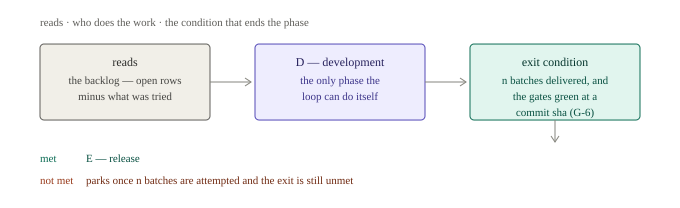

The only phase the loop runs itself. Its exit needs both halves: `n` batches
delivered **and** the gates green *at a commit sha* — a green gate on a dirty
tree is not evidence, because the sha it names is not the tree that ran.

Inside a batch, the loop looks like this:

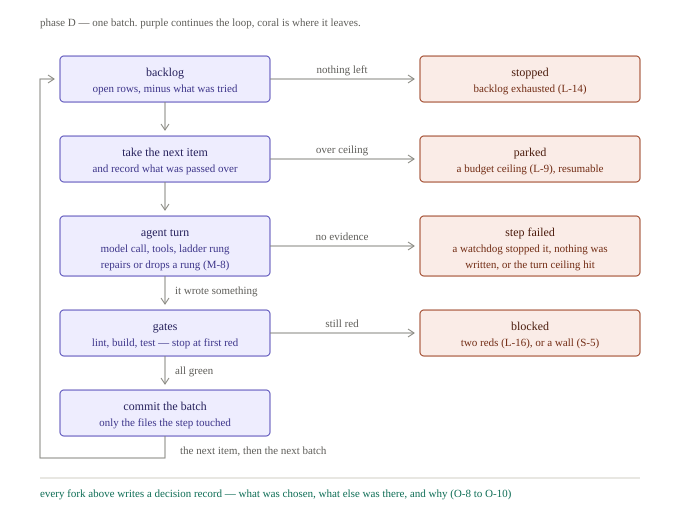

The shape worth noticing is that every sideways exit is a **different kind of
not-done**, and the harness keeps them apart rather than collapsing them into
"failed":

| Exit | Cause |
|---|---|
| stopped | the backlog is exhausted (`L-14`) |
| parked | a budget ceiling (`L-9`) — resumable, and the cycle's spend now survives a restart |
| step failed | a watchdog stopped it, nothing was written (`V-13`), or the turn ceiling hit |
| blocked | two red gates (`L-16`), or a credential wall (`S-5`) |

**There is no arrow from the agent to the commit.** A step that reports success
but wrote nothing leaves at *no evidence*; a step whose gates go red leaves at
*still red*. The gate is the only route to a commit, which is `V-2` — no
self-reported success — drawn rather than stated.

Two details that are easy to miss in the code:

- A credential wall is `blocked`, not `failed`. Retrying a 401 changes nothing,
  and the obvious thing a model reaches for after a failed retry is a
  credential. Blocking is what stops that path existing.
- The loop **cannot mark its own work done.** It writes code, runs gates and
  journals results; setting a `✅` is a person's, after reading the evidence.
  `perp check markers` reports where the file claims more than the journal
  supports.

---

## 8. Phase E — release

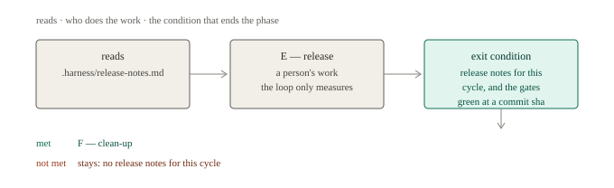

A person writes the release notes. The gates must still be green at a sha —
asked again here rather than trusted from D, because the tree has moved since.

`perp changelog --since <ref>` derives a grouped summary from the
`Requirement:` trailer each commit already carries, which is the mechanical
half of the same job.

---

## 9. Phase F — clean-up

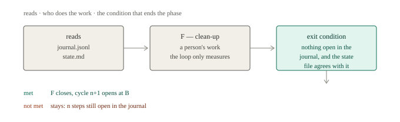

Reconcile before closing. Two conditions: nothing left open in the journal — a
step with an intent and no outcome is a hole — and the state file agrees with
what the journal projects.

When F closes it does not advance to G. It **cycles**: F closes and cycle `n+1`
opens at B.

---

## 10. Phase G — sunset

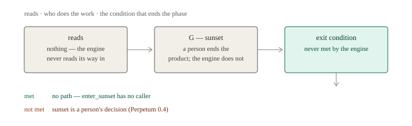

Sunset is a person's decision, and the engine never makes it. The exit condition
is named `NeverByTheEngine` and always returns not-met.

Stated plainly because the diagram would otherwise imply a path that is not
there: **the engine has no way into G at all.** `Machine::enter_sunset` exists
and has no caller outside a test, and that test asserts no approval unlocks it.
G is a documented terminus rather than a reachable state.

---

## Reading the diagrams

- **Purple** is the loop running or doing work.
- **Gray** is structural, or a person's work that the loop only measures.
- **Coral** is where the loop leaves — stopped, parked, failed, blocked.
- **Teal** is evidence and derivation: the journal, and the conditions read from it.

## Where this comes from

| Claim | Source |
|---|---|
| The 29 commands | `crates/perp/src/main.rs`, the `run` dispatch |
| Phase names and letters | `Phase::name`, `Phase::letter` |
| Every exit condition | `Exit::check` in `crates/perp-core/src/phase.rs` |
| Only D has loop work | `Driver::drive` in `crates/perp-core/src/cycle.rs` |
| The batch loop and its exits | `cycle.rs::batch`, `agent.rs::work`, `engine.rs` `Gates::perform` |
| G is unreachable | `phase.rs::enter_sunset`, and `crates/perp-core/unreachable-allow.txt` |
